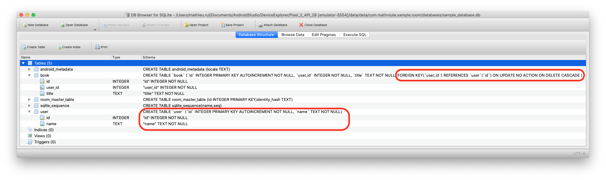
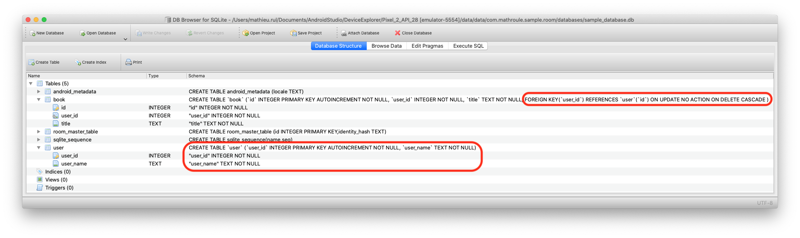
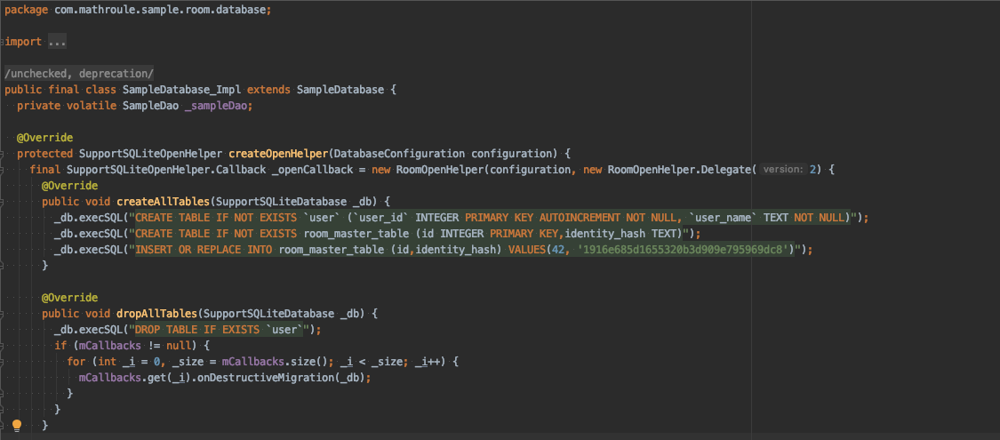
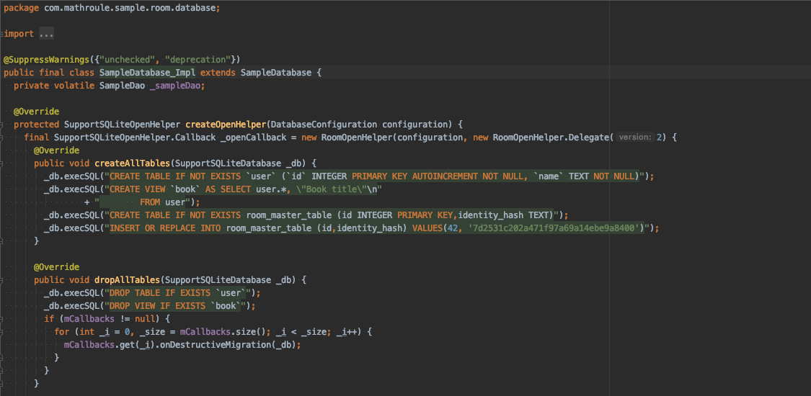

# Room delete entity sample

Sample project to showcase Room not deleting table when an entity is deleted during destructive migration.

To test the project, run master branch on a device. Then checkout one of the following branch and run it on the same device.

## Delete an entity
Branch [delete-book-entity](../../tree/delete-book-entity): `Book` entity has been removed from code. The `User` entity columns has been removed.
Room will not drop the table during the database destructive migration, it will lead to invalid foreign key constraint, since referenced column has been removed.

### Database schema version 1


### Database schema version 2


## Convert and entity to a database view
Branch [convert-book-entity-to-view](../../tree/convert-book-entity-to-view): `Book` entity has been transformed to a database view.
Room will not drop the table during the database destructive migration, but will try to delete the view. This lead to crash:
```
java.lang.RuntimeException: Unable to start activity ComponentInfo{com.mathroule.sample.room/com.mathroule.sample.room.MainActivity}: android.database.sqlite.SQLiteException: use DROP TABLE to delete table book (code 1 SQLITE_ERROR): , while compiling: DROP VIEW IF EXISTS `book`
    at android.app.ActivityThread.performLaunchActivity(ActivityThread.java:2913)
    at android.app.ActivityThread.handleLaunchActivity(ActivityThread.java:3048)
    at android.app.servertransaction.LaunchActivityItem.execute(LaunchActivityItem.java:78)
    at android.app.servertransaction.TransactionExecutor.executeCallbacks(TransactionExecutor.java:108)
    at android.app.servertransaction.TransactionExecutor.execute(TransactionExecutor.java:68)
    at android.app.ActivityThread$H.handleMessage(ActivityThread.java:1808)
    at android.os.Handler.dispatchMessage(Handler.java:106)
    at android.os.Looper.loop(Looper.java:193)
    at android.app.ActivityThread.main(ActivityThread.java:6669)
    at java.lang.reflect.Method.invoke(Native Method)
    at com.android.internal.os.RuntimeInit$MethodAndArgsCaller.run(RuntimeInit.java:493)
    at com.android.internal.os.ZygoteInit.main(ZygoteInit.java:858)
 Caused by: android.database.sqlite.SQLiteException: use DROP TABLE to delete table book (code 1 SQLITE_ERROR): , while compiling: DROP VIEW IF EXISTS `book`
    at android.database.sqlite.SQLiteConnection.nativePrepareStatement(Native Method)
    at android.database.sqlite.SQLiteConnection.acquirePreparedStatement(SQLiteConnection.java:903)
    at android.database.sqlite.SQLiteConnection.prepare(SQLiteConnection.java:514)
    at android.database.sqlite.SQLiteSession.prepare(SQLiteSession.java:588)
    at android.database.sqlite.SQLiteProgram.<init>(SQLiteProgram.java:58)
    at android.database.sqlite.SQLiteStatement.<init>(SQLiteStatement.java:31)
    at android.database.sqlite.SQLiteDatabase.executeSql(SQLiteDatabase.java:1769)
    at android.database.sqlite.SQLiteDatabase.execSQL(SQLiteDatabase.java:1698)
    at androidx.sqlite.db.framework.FrameworkSQLiteDatabase.execSQL(FrameworkSQLiteDatabase.java:242)
    at com.mathroule.sample.room.database.SampleDatabase_Impl$1.dropAllTables(SampleDatabase_Impl.java:44)
    at androidx.room.RoomOpenHelper.onUpgrade(RoomOpenHelper.java:114)
    at androidx.sqlite.db.framework.FrameworkSQLiteOpenHelper$OpenHelper.onUpgrade(FrameworkSQLiteOpenHelper.java:124)
    at android.database.sqlite.SQLiteOpenHelper.getDatabaseLocked(SQLiteOpenHelper.java:398)
    at android.database.sqlite.SQLiteOpenHelper.getWritableDatabase(SQLiteOpenHelper.java:298)
    at androidx.sqlite.db.framework.FrameworkSQLiteOpenHelper$OpenHelper.getWritableSupportDatabase(FrameworkSQLiteOpenHelper.java:92)
    at androidx.sqlite.db.framework.FrameworkSQLiteOpenHelper.getWritableDatabase(FrameworkSQLiteOpenHelper.java:53)
    at androidx.room.RoomDatabase.inTransaction(RoomDatabase.java:476)
    at androidx.room.RoomDatabase.assertNotSuspendingTransaction(RoomDatabase.java:281)
    at com.mathroule.sample.room.database.SampleDao_Impl.insert(SampleDao_Impl.java:39)
    at com.mathroule.sample.room.MainActivity.onCreate(MainActivity.kt:19)
    at android.app.Activity.performCreate(Activity.java:7136)
    at android.app.Activity.performCreate(Activity.java:7127)
    at android.app.Instrumentation.callActivityOnCreate(Instrumentation.java:1271)
    at android.app.ActivityThread.performLaunchActivity(ActivityThread.java:2893)
    at android.app.ActivityThread.handleLaunchActivity(ActivityThread.java:3048) 
    at android.app.servertransaction.LaunchActivityItem.execute(LaunchActivityItem.java:78) 
    at android.app.servertransaction.TransactionExecutor.executeCallbacks(TransactionExecutor.java:108) 
    at android.app.servertransaction.TransactionExecutor.execute(TransactionExecutor.java:68) 
    at android.app.ActivityThread$H.handleMessage(ActivityThread.java:1808) 
    at android.os.Handler.dispatchMessage(Handler.java:106) 
    at android.os.Looper.loop(Looper.java:193) 
    at android.app.ActivityThread.main(ActivityThread.java:6669) 
    at java.lang.reflect.Method.invoke(Native Method) 
    at com.android.internal.os.RuntimeInit$MethodAndArgsCaller.run(RuntimeInit.java:493) 
    at com.android.internal.os.ZygoteInit.main(ZygoteInit.java:858)
```

## Generated sample database implementation
Master | Removed Book entity | Converted Book entity to view
------------------------------------------------------------
 |  |  |
